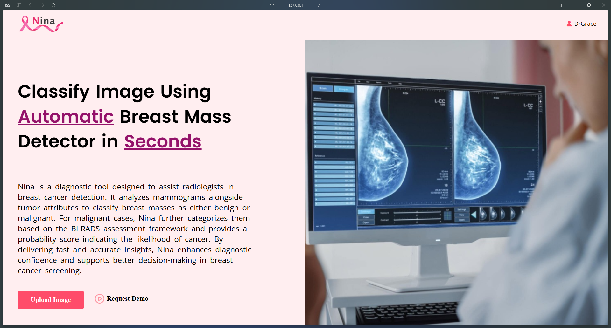
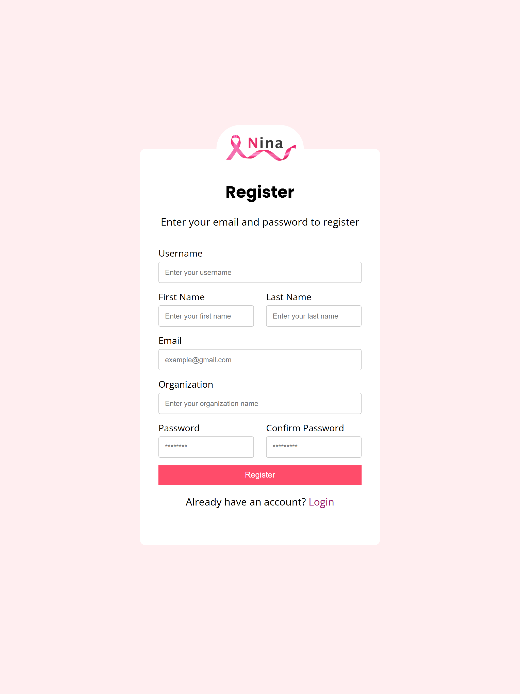
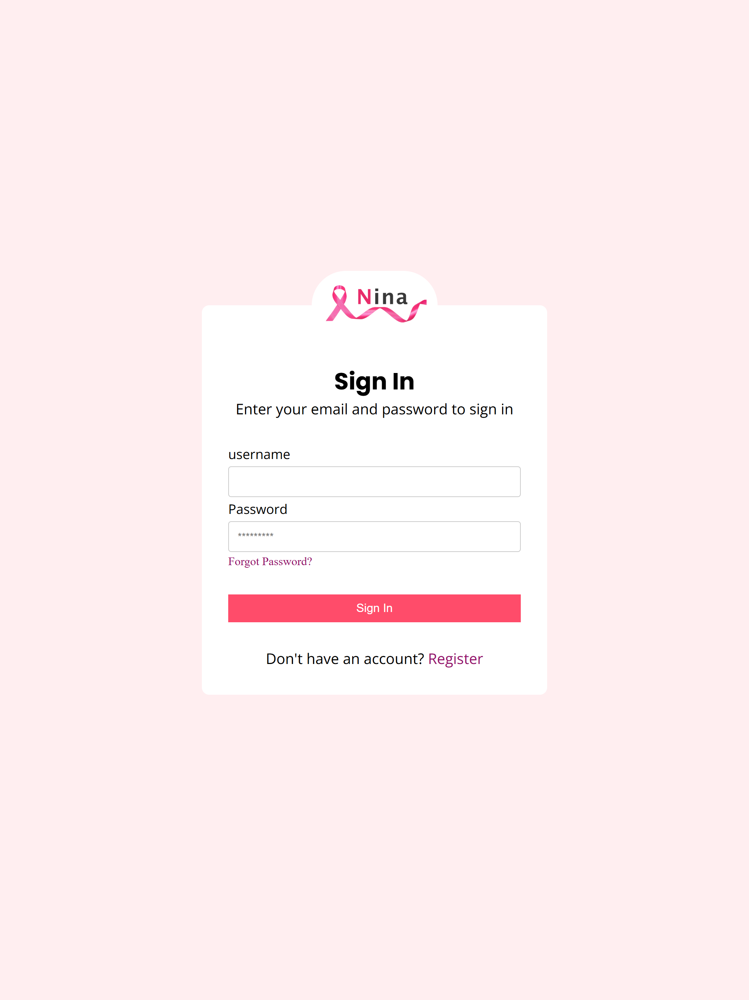
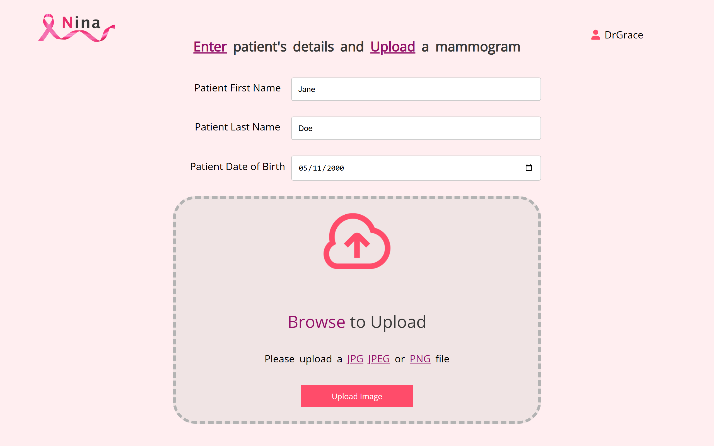
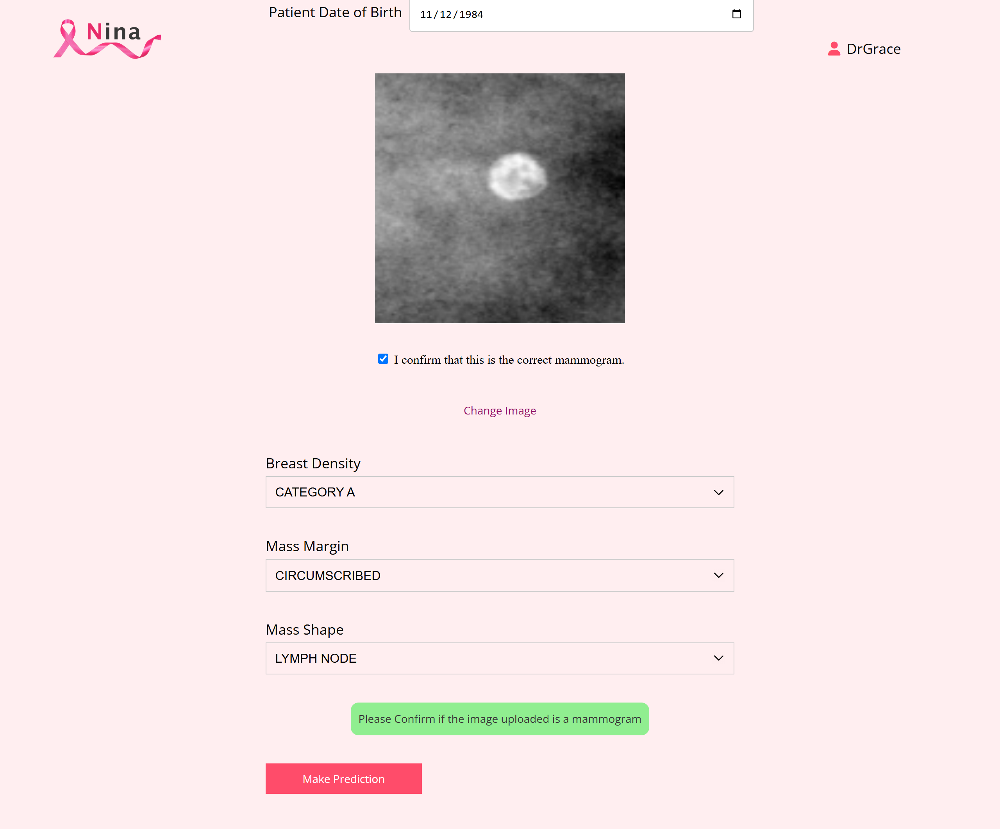
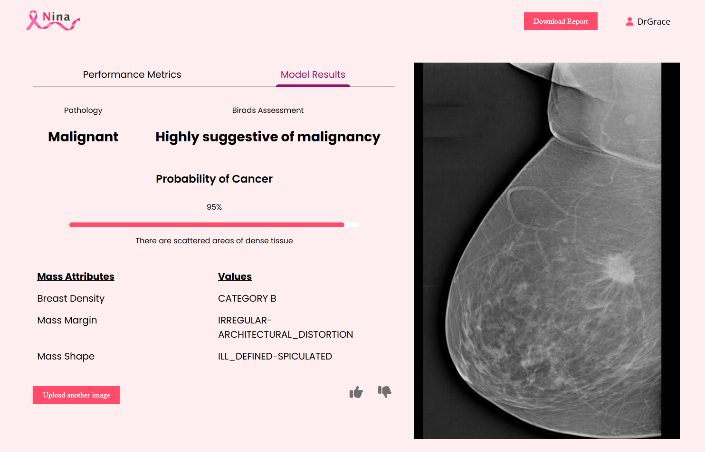

# NINA: BREAST CANCER DETECTION SYSTEM

## Overview
Nina is a breast cancer detection system that leverages **Convolutional Neural Networks (CNNs)** and **Machine Learning Algorithms** for binary classification of tumors and decision-making support for radiologists.


## Under the Hood
- **Model 1**: The **ResNet18** model is trained on the **CBIS-DDSM Dataset** for tumor classification
- **Model 2**: A **Random Forest Classifier** is trained on tumor features (e.g., breast density, mass margin, and mass shape) for BI-RADS classification.

## How It Works
1. A user/radiologist uploads a mammogram and enters tumor features:
   - **Breast Density**
   - **Mass Margin**
   - **Mass Shape**
2. The system provides:
   - **Prediction Results (Pathology)** from the ResNet18 model.
   - **BI-RADS Classification** from the Random Forest Classifier.
3. The radiologist can either approve or disapprove the model's results.

---

## Application Preview

### Landing Page


### Registration and Login Pages
<div style="display: flex; justify-content: space-between;">
    
    
</div>

### Upload Page
<div style="display: flex; justify-content: space-between; gap: 20px;">
    
    
</div>

### Results Page


---

## How to Run the Application

### Prerequisites
Ensure you have the following installed on your system:
- **Python 3.8+**
- **Django 4.0+**
- **Pip (Python Package Manager)**
- **Miniconda/anaconda**
- **Virtual Environment (Optional but recommended)**

### Steps to Run the Application

1. **Clone the Repository**
    ```bash
   git clone https://github.com/mwisechacha/project_nina.git
   cd project_nina

2. **Set Up Virtual Environment (optional)**
    ```bash
    python -m venv venv
    source venv/bin/activate   # On Windows venv\Scripts\activate

3. **Install Dependencies** 

    install all required Python packages using `pip`:
    ```bash
    pip install -r requirements.txt

4. **Apply migrations** 
    
    Set up the database by applying migrations:
    ```bash
    python manage.py makemigrations
    python manage.py migrate

5. **Run the Development Server**

    Start the Django development server:
    ```bash
    python manage.py runserver

6. **Access the application** 

    Open your browser and navigate to:
    ```bash
    http://127.0.0.1:8000/
